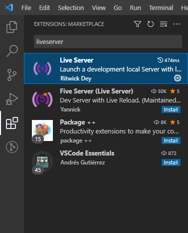
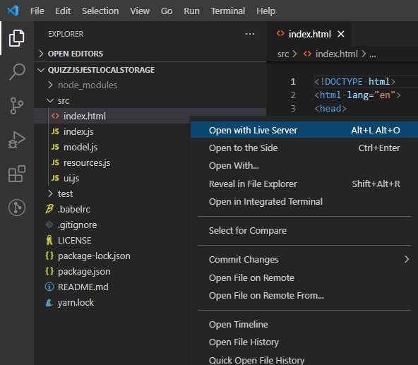

# Quizz GERAY BAGLAN

Pour lancer le projet avec VS Code :
  - `npm install` à la racine du projet
  - installer l'extension *Live Server*

  

  - ouvrir l'`index.html` avec *Live Server* (via un clique-droit)

  

  - ...et le projet se lance dans le navigateur par défaut !